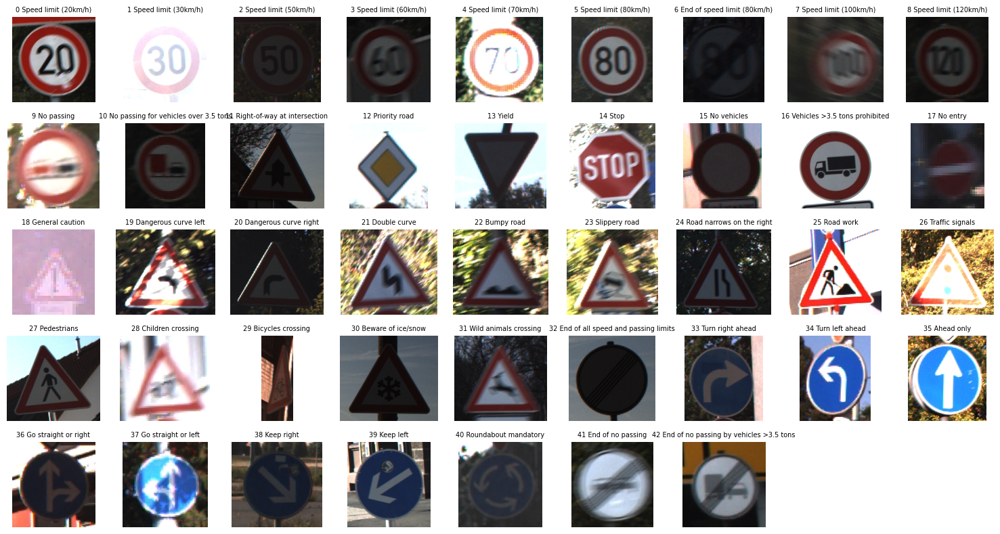

# Overview #
A convolutional neural network for German traffic sign image classification.

# Dataset #
[German Traffic Sign Recognition Dataset (GTSRB)](https://www.kaggle.com/datasets/meowmeowmeowmeowmeow/gtsrb-german-traffic-sign) is an image classification dataset.  
The images are photos of traffic signs. The images are classified into 43 classes. The training set contains 39209 labeled images and the test set contains 12630 images. Labels for the test set are not published.  
See more details [here](https://www.kaggle.com/datasets/meowmeowmeowmeowmeow/gtsrb-german-traffic-sign).

# Model #
- Frameworks: TensorFlow / Keras  
- Accuracy Achieved: **97% Test Accuracy**  
- Techniques Used:
  - Image Preprocessing & Normalization  
  - Data Augmentation (Rotation, Zoom, Brightness Shift, etc.)  
  - CNN Model with Dropout & Batch Normalization  
  - Checkpointing Best Model  
  

# Metrics #
The model achieved 97.01% accuracy on the test set.

| Metric     | Accuracy |
| ---------- | -------- |
| Training   | 95.74%   |
| Validation | 99.53%   |
| Test       | 97.01%   |
